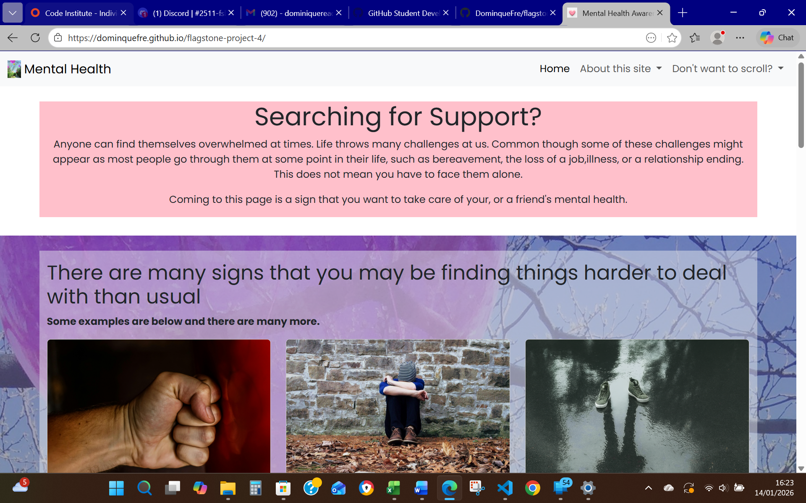

# flagstone-project-4
*The project brief below was selected.*
# Project 4: Mental Health Awareness
**External User’s Goal:** The user seeks accessible, beginner-friendly information on mental health, including how to recognize common issues and manage stress, presented in a supportive and organised layout.

**Site Owner’s Goal:** The site owner wants to create a welcoming webpage that provides basic mental health information using a clean and supportive design. The focus is on using HTML and CSS with Bootstrap to create a calming and well-organised user experience.

## Potential Features might Include:
- Hero Section with Positive Messaging: A Bootstrap Jumbotron with an encouraging message about mental health, using a calming colour scheme and a simple background image.
- Information Cards: Use Bootstrap’s card components to present mental health tips and common issues, providing a visually appealing way to organise content.
- Resource Links: A grid layout for external links to mental health resources styled with Bootstrap buttons to make them stand out.
- Positive Affirmations: Use Bootstrap’s text utilities to include a section with uplifting quotes or messages to encourage users.

Images of submitted website

|Source    |Usage      |Note       |
|----------|-----------|-----------|
|https://www.freepik.com/|AI generated image for use as a favicon|Pink heart 64x64|
|https://getbootstrap.com/docs/5.3/getting-started/introduction/|Initial Navigation Bar Bootstrap code|Edited to requirements.|
||Initial Cards Bootstrap code|Edited to requirements.|
||Initial Accordion code|Edited to requirements.|
||Initial Carousel Code|Edited to requirements.|
||||
|AI Generated|Navbar additional closing functionality|To supplement Bootstrap functionality|
||||
||||
|pexels-jessica-bryant-592135-1370700.jpg|Logo and Background image use||
|pexels-pixabay-163431.jpg|Image use|Anger|
|pexels-shanekell-1554613|Image use|Shoes|
|pexels-pixabay-262075.jpg|Image use|Stayaway|
|pexels-natalie-goodwin-2148267387-30983411|Image use|mindfulness|
|pexels-yankrukov-6815665|Image Use|physical|
|pexels-alisha-mishra-579430-1346381|Image Use|healthy|
|pexels-billy-10493902|Image Use|sleep|
|pexels-olly-3762802|Image Use|boundaries|
|pexels-elisabeth-ende-20918671-7431638|Image Use|journal|
|pexels-simon73-1552932|Image Use|nature|
|pexels-brett-sayles-3733929|Image Use|connect|
|pexels-yankrukov-8191522|Image Use|creativity|
||||
|https://www.mind.org.uk|Reference materials||
|https://www.samaritans.org|Reference materials||
||||

### LO1:
    (i)  There is one page and it is responsive
    (ii) Various links are included in the navigation to aid user experience
### LO2:
    (i) Used CSS prefixer
    /*
* Prefixed by https://autoprefixer.github.io
* PostCSS: v8.4.14,
* Autoprefixer: v10.4.7
* Browsers: last 4 version
*/
    Used Lighthouse / CSS checker / HTML checker
    (ii) Used additional CSS styling when needed to supplement the Bootstrap responsiveness
### LO3:
    (i)  Deployed regularly throughout the project, one issue - unknown if it was "rush hour" or a coding issue - next deployment had no issues.
### LO4:
    (i)  Minimial styling, use of AI and Bootstrap.
### LO5: AI usage
    (i) AI was used to ...
            Inline code help was useful in its' predictive nature when making a change, multiple times through a particular section of code - for example after deciding to use images in the suffer-section, it quickly made suitable suggestions for most of the other items in the list.
    (ii)    AI debugging was used as a first step in checking for potential issues prior to checking the deployed site, this enabled minor coding errors and other amendments and tidying of the code to be considered as I am currently learning, looking at the individual issues and deciding what needed to be done was a valuable learning exercise.
    (iii)   AI was able to improve performance by making suggestions such as lazy-loading - this has not been implemented in this case but will be considered for future projects.
            AI was able to improve User experience for mobile users by generating additional Javascript to enhance Bootstrap functinality
    (iv)    AI's role in the development process enabled some items to be added more quickly.  However not all suggestions were well-received by the mark-up checker and had to be "undone".  Aria-labels suggested by the AI were not compatible.

